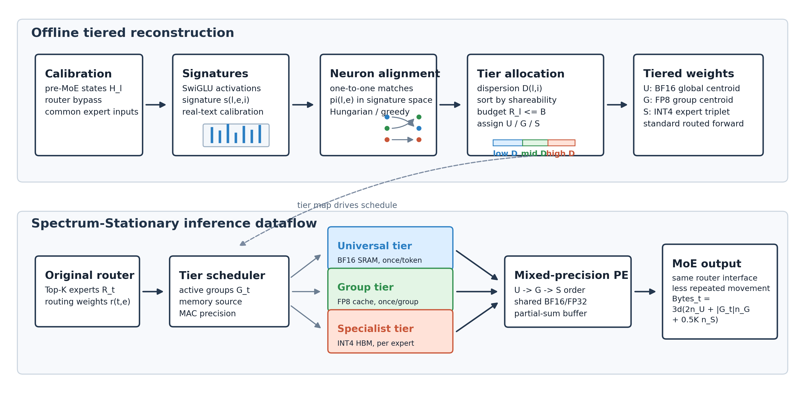

# NAQ-MoE

NAQ-MoE is a neuron-aligned mixed-precision framework for Mixture-of-Experts
LLM compression and hardware-aware execution. The codebase was developed under
the earlier working name `FANS-MoE`; some script names still keep that prefix
for experiment compatibility.

## Method

NAQ-MoE treats each SwiGLU neuron inside a routed expert as the compression
unit. The offline pipeline:

1. collects real-text calibration hidden states,
2. profiles each expert neuron by its activation signature,
3. aligns functionally corresponding neurons across routed experts,
4. computes aligned-slot functional dispersion,
5. assigns each slot to Universal, Group, or Specialist tiers under a storage
   budget,
6. reconstructs experts and evaluates a Spectrum-Stationary dataflow model.



## Repository Layout

- `src/`: experiment and analysis code.
- `configs/`: model and experiment configuration files.
- `scripts/`: reproducibility scripts used on the GPU workstation.
- `docs/`: method notes and internal algorithm specifications.
- `figures/`: method figure and lightweight result visualizations.
- `results/`: small JSON/Markdown summaries only.

Large generated artifacts such as activation tensors, alignment arrays, tier
maps, model checkpoints, datasets, and offload folders are intentionally ignored
by Git.

## Setup

```bash
conda create -n naq-moe python=3.11 -y
conda activate naq-moe
pip install -r requirements.txt
```

The experiments use `deepseek-ai/DeepSeek-V2-Lite` through Hugging Face. On the
original GPU station, the scripts were run with cached model files and:

```bash
export HF_ENDPOINT=https://hf-mirror.com
export CUDA_VISIBLE_DEVICES=3
```

## Quick Pilot

This runs the lightweight random-hidden pilot on the default representative
layer from `configs/deepseek_v2_lite.yaml`.

```bash
bash scripts/run_all.sh --output-dir outputs --force
```

## Real-Text Pipeline

The full real-text run used in the current paper draft:

```bash
bash scripts/run_realtext_full_gpu3.sh
```

The script runs:

1. `src/build_real_calibration.py`
2. `src/fans_moe_lite.py`
3. `src/compress_and_ppl.py`

Set `NAQ_MOE_ROOT` and `NAQ_MOE_VENV` if the repository or virtual environment
is not in the original workstation layout.

## Main Outputs

Small summaries from previous runs are under `results/`. The current real-text
summary is:

```text
results/realtext_512/EXPERIMENT_RESULTS.md
```

Raw outputs are not tracked. A typical run writes to:

```text
outputs_realtext_512/
  activations/
  alignments/
  distances/
  tier_maps/
  ppl/
```

These directories can be regenerated from the scripts and are ignored by Git.

